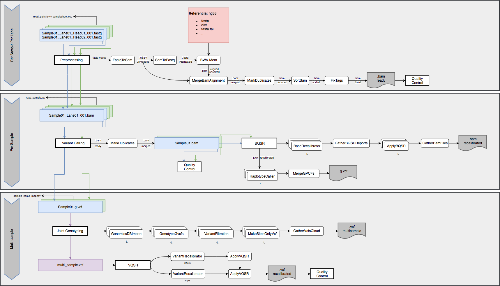

## Table of Contents

* [Prerequisites](#prerequisites)
* [Features](#features)
* [Usage](#usage)
    * [Set input parameters](#set-input-parameters)
    * [Build TSV for pair reads information](#build-tsv-for-pair-reads-information)
    * [Local](#local)
    * [HPC using Slurm scheduler](#hpc-using-slurm-scheduler)
* [Workflow](#workflow)
* [WDL Scripts](#wdl-scripts)

---

## Prerequisites

Basic software needed to run the pipeline:

* [GATK](https://software.broadinstitute.org/gatk/) (>= 4.0.0.0)
* [Cromwell](https://cromwell.readthedocs.io/en/stable/)
* [Womtool](https://cromwell.readthedocs.io/en/stable/WOMtool/) (Optional)
* [BWA](http://bio-bwa.sourceforge.net/)
* [Samtools, HTSlib](http://www.htslib.org/)
* [Picard](https://broadinstitute.github.io/picard/)
* [Python](https://www.python.org/)
* [Qualimap](http://qualimap.bioinfo.cipf.es/)

---

## Features

- Possibility to run on a HPC infrastructure connecting the Cromwell engine and the SLURM scheduler.
- Starts from BCL data.
- Demultiplexing of samples pooled across the flowcell.
- Data processing both on a per-lane and a per-sample basis.
- Possibility to handle hg19 and hg38 reference genomes.
- Programmed to restart from every step in case of fail.

For benchmarking, we are following the guidelines of the Truth and Consistency [precisionFDA challenges](https://precision.fda.gov/) using [Genome In A Bottle Consortium](http://jimb.stanford.edu/giab/) released genomes data.

---

## Usage

### Set input parameters

First of all, you need to configure all the inputs needed by the workflow. To do that, you need to change the values of the following parameters specified in the *inputs/WholeGenomeSequencingGATK4.inputs.json*.

```
{
   "##_1": "REFERENCE GENOME DATA",
   "##_NOTE_1": "Set '...' to your own path",

   "WholeGenomeSequencingGATK4WF.refBaseDir":  ".../hg38/",
   "WholeGenomeSequencingGATK4WF.refBaseName": "Homo_sapiens_assembly38",

   "WholeGenomeSequencingGATK4WF.refFasta":    ".../hg38/Homo_sapiens_assembly38.fasta",
   "WholeGenomeSequencingGATK4WF.refAlt":      ".../hg38/Homo_sapiens_assembly38.fasta.64.alt",
   "WholeGenomeSequencingGATK4WF.refIndex":    ".../hg38/Homo_sapiens_assembly38.fasta.fai",
   "WholeGenomeSequencingGATK4WF.refDict":     ".../hg38/Homo_sapiens_assembly38.dict",
   "WholeGenomeSequencingGATK4WF.refAmb":      ".../hg38/Homo_sapiens_assembly38.fasta.amb",
   "WholeGenomeSequencingGATK4WF.refAnn":      ".../hg38/Homo_sapiens_assembly38.fasta.ann",
   "WholeGenomeSequencingGATK4WF.refBwt":      ".../hg38/Homo_sapiens_assembly38.fasta.bwt",
   "WholeGenomeSequencingGATK4WF.refPac":      ".../hg38/Homo_sapiens_assembly38.fasta.pac",
   "WholeGenomeSequencingGATK4WF.refSa":       ".../hg38/Homo_sapiens_assembly38.fasta.sa",

   "WholeGenomeSequencingGATK4WF.dbSnpsVcf":                          ".../hg38/Homo_sapiens_assembly38.dbsnp138.vcf.gz",
   "WholeGenomeSequencingGATK4WF.dbSnpsVcfIdx":                       ".../hg38/Homo_sapiens_assembly38.dbsnp138.vcf.gz.tbi",
   "WholeGenomeSequencingGATK4WF.hapMapResourceVcf":                  ".../hg38/hapmap_3.3.hg38.vcf.gz",
   "WholeGenomeSequencingGATK4WF.hapMapResourceVcfIndex":             ".../hg38/hapmap_3.3.hg38.vcf.gz.tbi",
   "WholeGenomeSequencingGATK4WF.omniResourceVcf":                    ".../hg38/1000G_omni2.5.hg38.vcf.gz",
   "WholeGenomeSequencingGATK4WF.omniResourceVcfIndex":               ".../hg38/1000G_omni2.5.hg38.vcf.gz.tbi",
   "WholeGenomeSequencingGATK4WF.oneThousandGenomesResourceVcf":      ".../hg38/1000G_phase1.snps.high_confidence.hg38.vcf.gz",
   "WholeGenomeSequencingGATK4WF.oneThousandGenomesResourceVcfIndex": ".../hg38/1000G_phase1.snps.high_confidence.hg38.vcf.gz.tbi",
   "WholeGenomeSequencingGATK4WF.millsResourceVcf":                   ".../hg38/Mills_and_1000G_gold_standard.indels.hg38.vcf.gz",
   "WholeGenomeSequencingGATK4WF.millsResourceVcfIndex":              ".../hg38/Mills_and_1000G_gold_standard.indels.hg38.vcf.gz.tbi",
   "WholeGenomeSequencingGATK4WF.axiomPolyResourceVcf":               ".../hg38/Axiom_Exome_Plus.genotypes.all_populations.poly.hg38.vcf.gz",
   "WholeGenomeSequencingGATK4WF.axiomPolyResourceVcfIndex":          ".../hg38/Axiom_Exome_Plus.genotypes.all_populations.poly.hg38.vcf.gz.tbi",

   "##CAMBIAR VALOR DE LAS 2 SIGUIENTES": "wgsCoverageIntervalList y wgsEvaluationIntervalList",
   "WholeGenomeSequencingGATK4WF.wgsCoverageIntervalList":   ".../hg38/Homo_sapiens_assembly38.fasta.sa",
   "WholeGenomeSequencingGATK4WF.wgsEvaluationIntervalList": ".../hg38/Homo_sapiens_assembly38.fasta.sa",

   "WholeGenomeSequencingGATK4WF.knownIndelsSitesVcfs": [
      ".../hg38/Mills_and_1000G_gold_standard.indels.hg38.vcf.gz", 
      ".../hg38/Homo_sapiens_assembly38.known_indels.vcf.gz"
   ],
   "WholeGenomeSequencingGATK4WF.knownIndelsSitesIndices": [
      ".../hg38/Mills_and_1000G_gold_standard.indels.hg38.vcf.gz.tbi",
      ".../hg38/Homo_sapiens_assembly38.known_indels.vcf.gz.tbi"
   ],

   "##_HG38_INTERVAL_LIST": "intervalList, scatterCount, breakBandsAtMultiplesOf, intervalListOutDir, useGenomicsDB",
   "WholeGenomeSequencingGATK4WF.intervalList": ".../hg38/wgs_calling_regions.hg38.interval_list",
   "WholeGenomeSequencingGATK4WF.scatterCount": 5,
   "WholeGenomeSequencingGATK4WF.breakBandsAtMultiplesOf": 1000000,
   "WholeGenomeSequencingGATK4WF.intervalListOutDir": "intervalsDirectory",
   "WholeGenomeSequencingGATK4WF.useGenomicsDB": true,

   "##_VQSR_PARAMS": "tranches, annotations, filter levels...",
   "WholeGenomeSequencingGATK4WF.snpRecalibrationTrancheValues": ["100.0", "99.95", "99.9", "99.8", "99.6", "99.5", "99.4", "99.3", "99.0", "98.0", "97.0", "90.0"],
   "WholeGenomeSequencingGATK4WF.snpRecalibrationTrancheValues_SMALL_LIST": ["100.0", "99.9", "99.0", "90.0"],
   "WholeGenomeSequencingGATK4WF.snpRecalibrationAnnotationValues": ["QD", "MQRankSum", "ReadPosRankSum", "FS", "MQ", "SOR", "DP"],
   "WholeGenomeSequencingGATK4WF.indelRecalibrationTrancheValues": ["100.0", "99.95", "99.9", "99.5", "99.0", "97.0", "96.0", "95.0", "94.0", "93.5", "93.0", "92.0", "91.0", "90.0"],
   "WholeGenomeSequencingGATK4WF.indelRecalibrationTrancheValues_SMALL_LIST": ["100.0", "99.9", "99.0", "95.0", "90.0"],
   "WholeGenomeSequencingGATK4WF.indelRecalibrationAnnotationValues": ["QD", "MQRankSum", "ReadPosRankSum", "FS", "SOR", "DP"],
   "WholeGenomeSequencingGATK4WF.snpFilterLevel": 99.7,
   "WholeGenomeSequencingGATK4WF.indelFilterLevel": 99.7,
   "WholeGenomeSequencingGATK4WF.snpVQSRDownsampleFactor": 10,
   "WholeGenomeSequencingGATK4WF.indelsMaxGaussians": 2,
   "WholeGenomeSequencingGATK4WF.snpsMaxGaussians": 4,

   "##_2": "READS",
   "##_NOTE_2": "Set '...' to reads path.",
   "WholeGenomeSequencingGATK4WF.fastqReadsTSV": ".../reads/read_pairs.tsv",
   "WholeGenomeSequencingGATK4WF.libraryName": "LIB-01",
   "WholeGenomeSequencingGATK4WF.platform": "illumina",
   "WholeGenomeSequencingGATK4WF.sequencingCenter": "ITER-GENOMICA",

   "##_3": "BWA",
   "##_NOTE_3": "Set '...' to BWA path.",
   "WholeGenomeSequencingGATK4WF.bwaPath": ".../bwa",
   "WholeGenomeSequencingGATK4WF.bwaMemCommand_pairedSplit": "mem -K 100000000 -v 3 -t 2 -Y $bashRefFasta $bashReadFastq1 $bashReadFastq2",
   "WholeGenomeSequencingGATK4WF.bwaMemCommand": "mem -K 100000000 -p -v 3 -t 2 -Y $bashRefFasta $bashReadFastq",   

   "##_4": "SAMTOOLS",
   "##_NOTE_4": "Set '...' to Samtools path.",
   "WholeGenomeSequencingGATK4WF.samtoolsPath": ".../samtools",

   "##_5": "GATK",
   "##_NOTE_5": "Set '...' to GATK4 path.",
   "WholeGenomeSequencingGATK4WF.gatkPath": ".../gatk",

   "##_6": "PICARD",
   "##_NOTE_6": "Set '...' to Picard path.",
   "WholeGenomeSequencingGATK4WF.picardPath": ".../picard.jar",

   "##_7": "PYTHON",
   "##_NOTE_7": "Set python path and TSV intervals file.",
   "WholeGenomeSequencingGATK4WF.pythonPath": ".../python2",
   "WholeGenomeSequencingGATK4WF.TSVIntervalsFile": ".../intervals.tsv",
   "WholeGenomeSequencingGATK4WF.protectionTag": ":1+",

   "##_8": "QUALIMAP",
   "##_NOTE_8": "Set '...' to Qualimap path.",
   "WholeGenomeSequencingGATK4WF.qualimapPath": ".../qualimap",

   "##_9": "RESULTS DIR",
   "##_NOTE_9": "Set '...' to results path.",
   "WholeGenomeSequencingGATK4WF.resultsDir": ".../results",

   "##_10": "CONFIGURATION PARAMETERS",
   "WholeGenomeSequencingGATK4WF.wfPerSamplePerLane": true,
   "WholeGenomeSequencingGATK4WF.wfPreprocess": true,
   "WholeGenomeSequencingGATK4WF.wfQC_PerSamplePerLane": false,

   "WholeGenomeSequencingGATK4WF.wfPerSample": true,
   "WholeGenomeSequencingGATK4WF.wfVariantCalling": true,
   "WholeGenomeSequencingGATK4WF.wfBQSR": true,
   "WholeGenomeSequencingGATK4WF.wfQC_PerSample": false,

   "WholeGenomeSequencingGATK4WF.wfMultiSample": true,
   "WholeGenomeSequencingGATK4WF.wfJointGenotyping": true,
   "WholeGenomeSequencingGATK4WF.wfVQSR": true,
   "WholeGenomeSequencingGATK4WF.wfQC_MultiSample": true,

   "WholeGenomeSequencingGATK4WF.firstStep": 0,
   "WholeGenomeSequencingGATK4WF.lastStep": 100,

   "##_11": "Java Opts: Select Xms16g for 30GB-RAM and 60GB-RAM nodes. Select Xmx28g for 30GB-RAM or Xmx56 for 60GB-RAM nodes",
   "WholeGenomeSequencingGATK4WF.javaOpts": "-Xmx8g -Xms8g"
}
```

Optionally, you can create a clean JSON template with these parameters using Womtool with the following command:

```
java -jar womtool-<version>.jar inputs WholeGenomeSequencingGATK4.wdl > WholeGenomeSequencingGATK4.inputs.json
```

### Build TSV for pair reads information

In order to run the pipeline, you need to create a TSV file with the following columns for each pair of reads (per-sample and per-lane):

```
FLOWCELL  LANE  SAMPLE_ID  INDEX SAMPLE_PROJECT  SAMPLE_DIRECTORY READ1  READ2
```

For example:

```
H814YADXX 1 A CGATGT  A_Index  A_L001_001 /path/to/A_L001_R1.fastq.gz /path/to/A_L001_R2.fastq.gz
H814YADXX 2 A CGATGT  A_Index  A_L002_001 /path/to/A_L002_R1.fastq.gz /path/to/A_L002_R2.fastq.gz
H814YADXX 1 B TGACCA  B_Index  B_L001_001 /path/to/B_L001_R1.fastq.gz /path/to/B_L001_R2.fastq.gz
H814YADXX 2 B TGACCA  B_Index  B_L002_001 /path/to/B_L002_R1.fastq.gz /path/to/B_L002_R2.fastq.gz
```


### Local

You can run cromwell in local with its default settings or create a configuration file if you want to customize some settings. In the *backends/backend-local.conf* file, we set the **localization** option to create **soft-links** instead of create hard-links or copies of the input and output files.

```
include required(classpath("application"))

backend {
  default="Local"
  providers {
    Local {
      config {
        filesystems {
          local {
            localization: [
              "soft-link", "copy", "hard-link"
            ]
          }
        }
      }
    }
  }
}
```

Use the following command to run the workflow in your system using this configuration file:
```
java -Dconfig.file=./backends/backend-local.conf -jar cromwell-<version>.jar run ./pipelines/WholeGenomeSequencingGATK4.wdl -i ./inputs/WholeGenomeSequencingGATK4.inputs.json -m metadata.json
```

### HPC using Slurm scheduler

To run Cromwell in a HPC environment with Slurm scheduler, you need to change the Cromwell configuration to interact with a SLURM and dispatch jobs to it. We provide this configuration in the *backends/backend-slurm.conf* file:

```
include required(classpath("application"))

# Backend for SLURM executions
backend {
  default = "Slurm"
  providers {
    # Slurm configuration
    Slurm {
      actor-factory = "cromwell.backend.impl.sfs.config.ConfigBackendLifecycleActorFactory"
      config {
        runtime-attributes = """
        String queue = "long"
        Int nodes = 1
        Int tasks_per_node = 16
        String runtime_minutes = "3-00:00:00"
        Int mem = 60000
        """

        submit = """
            sbatch \
            -J ${job_name} \
            -D ${cwd} \
            -o ${out} \
            -e ${err} \
            -p ${queue} \
            -N ${nodes} \
            --tasks-per-node ${tasks_per_node} \
            -t ${runtime_minutes} \
            --mem ${mem} \
            --wrap "/bin/bash ${script}"
        """

        # Int cpus = 8
        # Int requested_memory_mb_per_core = 1000
        # Other options
            #${"-n " + cpus} \
            #--mem-per-cpu=${requested_memory_mb_per_core} \

        kill = "scancel ${job_id}"
        check-alive = "squeue -j ${job_id}"
        job-id-regex = "Submitted batch job (\\d+).*"

        filesystems {
          local {
            localization: [
              "soft-link", "copy", "hard-link"
            ]
          }
        }
      }
    }
  }
}
```

In the file *slurm/run_pipeline.sh*, we provide a **Bash** script with the commands to run Cromwell using Slurm with the previous configuration file:

```
#!/bin/bash
#SBATCH -p long
#SBATCH -N 1
#SBATCH --tasks-per-node=16
#SBATCH -t 3-00:00:00
#SBATCH --mem=60000
#SBATCH -o slurm-wgs-gatk-%j.out
#SBATCH -e slurm-wgs-gatk-%j.err

source /etc/profile.d/profile.modules.sh
module load java-jre/1.8.0_77
module load gatk/4.0.6.0
module load bwa/0.7.15
module load picard/2.10.10
module load python/2.7.14
module load python/3.4.5
module load proj/4.9.3/gcc gdal/2.2.4/gcc gcc/6.1.0 tiff/4.0.9/gcc pcre/3.38/gcc curl/7.40/gcc xz/5.2.2/gcc R/3.5-GA/gcc
module load samtools/1.7
module load htslib/1.3.1
module load java-jre/1.8.0_77 qualimap/2.2.1

java -Dconfig.file=./backends/backend-slurm.conf \
-jar .../cromwell-<version>.jar \
run ./pipelines/WholeGenomeSequencingGATK4.wdl \
-i ./inputs/WholeGenomeSequencingGATK4.inputs.json \
-m metadata.json
```

Use the following command to run the script in a system with Slurm scheduler (such as TeideHPC). Thanks to the **screen** tool, the workflow will continue running even if you log out of your session:
```
screen -d -m -t wgs-wdl-pipeline -L sh ./slurm/run_pipeline.sh
```

---

## Workflow



### A. Per sample, per lane

#### 1. Preprocessing
    1. FastqToSam....................................(step 1)
    2. SamToFastq....................................(step 2)
    3. Bwa Mem.......................................(step 3)
    4. MergeBamAlignments............................(step 4)
    5. MarkDuplicates................................(step 5)
    6. SortSam.......................................(step 6)
    7. SetNmMdAndUqTags..............................(step 7)

#### 2. Quality Control
    1. ValidateSam...................................(step 8)
    2. Qualimap......................................(step 9)
    3. CollectRawWgsMetrics (3-0)....................(step 10)
    4. CollectRawWgsMetrics (20-20)..................(step 11)
    5. CollectWgsMetricsWithNonZeroCoverage..........(step 12)
    6. ¿DepthOfCoverage?.............................(step 13)
    7. CollectMultipleMetrics........................(step 14)
    8. ¿CallableLoci?................................(step 15)
 
### B. Per sample
   
#### 1. Variant Calling
    1. MarkDuplicates (MergeBamsPerSample)............(step 16)
    2. BQSR
        1. BaseRecalibrator (by intervals*)...........(step 17)
        2. GatherBQSRReports..........................(step 18)
        3. ApplyBQSR (by intervals*)..................(step 19)
        4. GatherBamFiles.............................(step 20)
    3. HaplotypeCaller (by intervals*)................(step 21)
    4. MergeVcfs......................................(step 22)
 
#### 2. Quality Control (Using MarkDuplicates (MergeBamsPerSample) output file)
    1. ValidateSam....................................(step 23)
    2. ¿DepthOfCoverage?..............................(step 24)
    3. CollectMultipleMetrics.........................(step 25)
    4. ¿CallableLoci?.................................(step 26)
 
### C. Multi-sample
 
#### 1. Joing Genotyping
    if (useGenomicsDB == true)
        1. GenomicsDBImport (by intervals*)...........(step 27)───┐
    else                                                          |─ In the inputs JSON file, select if you are using GenomicsDB or not.
        1. CombineGVCFs (by intervals*)...............(step 27)───┘
    2. GenotypeGVCFs (by intervals*)..................(step 28)
    3. VariantFiltration (by intervals*)..............(step 29)
    4. MakeSitesOnlyVcf (by intervals*)...............(step 30)
    5. GatherVcfsCloud................................(step 31)
    6. VQSR
        1. SNPs
            1. VariantRecalibratorCreateModel.........(step 32)
        2. Indels
            1. VariantRecalibrator....................(step 33)
        3. ApplyRecalibration (by intervals*).........(step 34)
        4. CollectVariantCallingMetrics...............(step 35)


**\* Intervals:**
   * The -L argument directs the GATK engine to restrict processing to specific genomic intervals.
   * This argument allows the pipeline to run the Scatter-Gather functionality.

---

## WDL Scripts

Hierarchy tree:

```
WholeGenomeSequencingGATK4.wdl
    |
    |
    └─── SetWorkingDirectory.wdl
    |
    |
    └─── Preprocessing.wdl
    |    |
    |    |
    |    └─── QualityControl.wdl
    |
    |
    └─── VariantCallingPerSample.wdl
    |    |
    |    |
    |    └─── BaseQualityScoreRecalibration.wdl
    |    |
    |    |
    |    └─── QualityControlPerSample.wdl
    |
    |
    └─── JointGenotyping.wdl
         |
         |
         └─── VariantQualityScoreRecalibration.wdl
```

---
